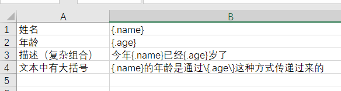

# `EasyExcel`

## 一、初识`EasyExcel`

### 1. Apache POI

先说`POI`，有过报表导入导出经验的同学，应该听过或者使用。

`Apache POI`是Apache软件基金会的开源函式库，提供跨平台的`Java API`实现`Microsoft Office`格式档案读写。但是存在如下一些问题：

#### 1.1 学习使用成本较高

对POI有过深入了解的才知道原来POI还有SAX模式（Dom解析模式）。但SAX模式相对比较复杂，excel有03和07两种版本，两个版本数据存储方式截然不同，sax解析方式也各不一样。

想要了解清楚这两种解析方式，才去写代码测试，估计两天时间是需要的。再加上即使解析完，要转换到自己业务模型还要很多繁琐的代码。总体下来感觉至少需要三天，由于代码复杂，后续维护成本巨大。

POI的SAX模式的API可以一定程度的解决一些内存溢出的问题，但是POI还是有一些缺陷，比如07版Excel解压缩以及解压后存储都是在内存中完成的，内存消耗依然很大，一个3M的Excel用POI的SAX解析，依然需要100M左右内存。

#### 1.2 POI的内存消耗较大

大部分使用POI都是使用他的userModel模式。userModel的好处是上手容易使用简单，随便拷贝个代码跑一下，剩下就是写业务转换了，虽然转换也要写上百行代码，相对比较好理解。然而userModel模式最大的问题是在于非常大的内存消耗，一个几兆的文件解析要用掉上百兆的内存。现在很多应用采用这种模式，之所以还正常在跑一定是并发不大，并发上来后一定会OOM或者频繁的full gc。

总体上来说，简单写法重度依赖内存，复杂写法学习成本高。

#### 特点

1. 功能强大

2. 代码书写冗余繁杂

3. 读写大文件耗费内存较大，容易OOM

   

### 2. `EasyExcel`

#### 2.1 重写了POI对07版Excel的解析

- EasyExcel重写了POI对07版Excel的解析，可以把内存消耗从100M左右降低到10M以内，并且再大的Excel不会出现内存溢出，03版仍依赖POI的SAX模式。

- 下图为64M内存1分钟内读取75M(46W行25列)的Excel（当然还有急速模式能更快，但是内存占用会在100M多一点）


- 在上层做了模型转换的封装，让使用者更加简单方便

#### 特点

1. 在数据模型层面进行了封装，**使用简单**
2. 重写了07版本的Excel的解析代码，降低内存消耗，能有效避免OOM
3. 只能操作Excel
4. 不能读取图片


0. 使用程序读写excel，数据在excel文件、程序<实体类、Map>这两个载体中间相互流转。


优雅编程	lombok


## 二、快速入门--QuickStart

### 0、导入依赖坐标

```xml
<!-- EasyExcel -->
<dependency>
    <groupId>com.alibaba</groupId>
    <artifactId>easyexcel</artifactId>
    <version>2.1.6</version>
</dependency>
<!-- lombok 优雅编程 -->
<dependency>
    <groupId>org.projectlombok</groupId>
    <artifactId>lombok</artifactId>
    <version>1.18.10</version>
</dependency>
<!-- junit -->
<dependency>
    <groupId>junit</groupId>
    <artifactId>junit</artifactId>
    <version>4.12</version>
</dependency>
```

> 导入`easyexcel-2.1.6`坐标的时候，以依赖传递导入`poi-3.17`的POI。如果	·


### 1、最简单的读

#### 1.1、需求、准备工作

```java
/**
 * 需求：单实体导入
 * 导入Excel学员信息到系统。
 * 包含如下列：姓名、性别、出生日期
 * 模板详见：杭州黑马在线202003班学员信息.xls
 */
```

```java
// 杭州黑马在线202003班学员信息.xls文件
```


#### 1.2、编写导出数据的实体

```java
// 基于lombok
@Data
@NoArgsConstructor
@AllArgsConstructor
public class Student {
    /**
     * 学生姓名
     */
    private String name;
    /**
     * 学生性别
     */
    private String gender;

    /**
     * 学生出生日期
     */
    private Date birthday;
    /**
     * id
     */
    private String id;
}
```


#### 1.3、 读取`Excel`文件

调用`EasyExcel`的`API`读取的`Excel`文件的测试类`StudentReadDemo`

```java
package com.itheima.demo;

import com.alibaba.excel.EasyExcel;
import com.alibaba.excel.read.builder.ExcelReaderSheetBuilder;
import com.itheima.domain.Student;
import com.itheima.listener.StudentReadListener;

import java.io.FileNotFoundException;

/**
 * @Author Vsunks.v
 * @Date 2020/3/11 23:28
 * @Description:
 */
public class StudentReadDemo {
    public static void main(String[] args) throws FileNotFoundException {
        // 读取文件，读取完之后会自动关闭
        /*
        	pathName  		文件路径；"d:\\杭州黑马在线202003班学员信息.xls"
        	head			每行数据对应的实体；Student.class
        	readListener	读监听器，每读一样就会调用一次该监听器的invoke方法
        
        	sheet方法参数： 工作表的顺序号（从0开始）或者工作表的名字，不传默认为0
        */
        // 封装工作簿对象
        ExcelReaderBuilder workBook = EasyExcel.read
                ("d:\\杭州黑马在线202003班学员信息.xls", Student.class, new StudentReadListener());

        // 封装工作表
        ExcelReaderSheetBuilder sheet1 = workBook.sheet();
        // 读取
        sheet1.doRead();
    }
}

```

读取Excel的监听器，用于处理读取产生的数据

```java
package com.itheima.listener;

import com.alibaba.excel.context.AnalysisContext;
import com.alibaba.excel.event.AnalysisEventListener;
import com.itheima.domain.Student;

/**
 * @Author Vsunks.v
 * @Date 2020/3/11 23:12
 * @Description:
 */
public class StudentReadListener extends AnalysisEventListener<Student> {
    // 每读一样，会调用该invoke方法一次
    @Override
    public void invoke(Student data, AnalysisContext context) {
        System.out.println("data = " + data);
        log.info(data + "保存成功");
    }

    // 全部读完之后，会调用该方法
    @Override
    public void doAfterAllAnalysed(AnalysisContext context) {
        // TODO......
    }
}
```


### 2、最简单的写

#### 2.1 需求、准备工作

```java
/**
 * 需求：单实体导出
 * 导出多个学生对象到Excel表格
 * 包含如下列：姓名、性别、出生日期
 * 模板详见：杭州黑马在线202003班学员信息.xlsx
 */
```


#### 2.2、编写导出数据的实体

```java
// 使用lombok
package com.itheima.domain;

@Data
@AllArgsConstructor
@NoArgsConstructor
@ColumnWidth(20)
public class Student {


    /**
     * id
     */
    //@ExcelProperty(value = "编号",index = 3)
    @ExcelIgnore
    private String id;
    /**
     * 学生姓名
     */
    @ExcelProperty(value = "学生姓名", index = 0)
    //@ColumnWidth(30)
    private String name;
    /**
     * 学生性别
     */
    @ExcelProperty(value = "学生性别", index = 2)
    private String gender;

    /**
     * 学生出生日期
     */
    @ExcelProperty(value = "学生出生日期", index = 1)
    //@ColumnWidth(20)
    private Date birthday;
}
```


#### 2.3、 准备数据并写入到文件

```java
package com.itheima.demo;

import com.alibaba.excel.EasyExcel;
import com.alibaba.excel.write.builder.ExcelWriterBuilder;
import com.itheima.domain.Student;

import java.util.ArrayList;
import java.util.Date;
import java.util.List;

/**
 * @Author Vsunks.v
 * @Date 2020/3/11 23:27
 * @Description:
 */
public class StudentWriteDemo {
    public static void main(String[] args) {

        List<Student> students = initData();
        /*
            String pathName 写入文件的路径
            Class head      写入文件的对象类型
            默认写入到07的xlsx中，如果想要写入xls，可以指定类型（待验证）
         */
        ExcelWriterBuilder workBook = EasyExcel.write("d:\\杭州黑马学员表.xlsx", Student.class);

        // sheet方法参数： 工作表的顺序号（从0开始）或者工作表的名字
        workBook.sheet().doWrite(students);
    }

    private static List<Student> initData() {
        ArrayList<Student> students = new ArrayList<Student>();
        Student data = new Student();
        for (int i = 0; i < 10; i++) {
            data.setName("杭州黑马学号0" + i);
            data.setBirthday(new Date());
            data.setGender("男");
            students.add(data);
        }
        return students;
    }
}
```


### 3、文件上传和下载

基于SpringMVC的文件上传和下载

**0. 导入依赖**

```xml
<!-- EasyExcel -->
<dependency>
    <groupId>com.alibaba</groupId>
    <artifactId>easyexcel</artifactId>
    <version>2.0.5</version>
</dependency>
<!-- lombok -->
<dependency>
    <groupId>org.projectlombok</groupId>
    <artifactId>lombok</artifactId>
    <version>1.18.10</version>
    <scope>provided</scope>
</dependency>
<!-- junit -->
<dependency>
    <groupId>junit</groupId>
    <artifactId>junit</artifactId>
    <version>4.12</version>
</dependency>
<dependency>
    <groupId>org.slf4j</groupId>
    <artifactId>slf4j-nop</artifactId>
    <version>1.7.2</version>
</dependency>
<!-- SpringMVC（Spring） -->
<dependency>
    <groupId>org.springframework</groupId>
    <artifactId>spring-webmvc</artifactId>
    <version>5.0.5.RELEASE</version>
</dependency>
<!-- Servlet -->
<dependency>
    <groupId>javax.servlet</groupId>
    <artifactId>javax.servlet-api</artifactId>
    <version>4.0.1</version>
    <scope>provided</scope>
</dependency>
<!-- 文件上传 -->
<dependency>
    <groupId>commons-fileupload</groupId>
    <artifactId>commons-fileupload</artifactId>
    <version>1.4</version>
</dependency>
```


#### 3.1 文件上传

编写excel中每一行对应的实体类

```java
@Data
@NoArgsConstructor
@AllArgsConstructor
public class Student {
    /**
     * 学生姓名
     */
    private String name;
    /**
     * 学生性别
     */
    private String gender;

    /**
     * 学生出生日期
     */
    private Date birthday;
    /**
     * id
     */
    private String id;
}

```

编写回调监听器StudentReadListener

```java
@Component
@Scope("prototype")	// 作者要求每次读取都要使用新的Listener
public class StudentReadListener extends AnalysisEventListener<Student> {

    @Autowired
    private StudentService studentService;

    private final int BATCH_SAVE_NUM = 5;
    ArrayList<Student> students = new ArrayList<>();


    private int count = 0;

    // 每读一样，会调用该invoke方法一次
    @Override
    public void invoke(Student data, AnalysisContext context) {
        students.add(data);
        if (++count % BATCH_SAVE_NUM == 0) {
            studentService.save(students);
            students.clear();
        }
    }

    // 全部读完之后，会调用该方法
    @Override
    public void doAfterAllAnalysed(AnalysisContext context) {
        // TODO......
    }
}

```

业务代码接口StudentService和实现类StudentServiceImpl

```java
public interface StudentService {
    void save(ArrayList<Student> students);
}

@Service
public class StudentServiceImpl implements StudentService {
    @Override
    public void save(ArrayList<Student> students) {
        System.out.println("students in service = " + students);
    }
}
```


Spring配置文件

```xml
<!-- 组件扫描-->
<context:component-scan base-package="com.itheima"/>
```

SpringMVC配置文件

```xml
<!-- 组件扫描-->
<context:component-scan base-package="com.itheima.demo"/>

<!-- MVC文件上传多部件解析器 -->
<bean class="org.springframework.web.multipart.commons.CommonsMultipartResolver"
      id="multipartResolver"/>
```


编码读取上传的Excel文件

```java
@Controller
public class WebUploadAndDownload {
    /**
     * 文件上传
     * 1. 编写excel中每一行对应的实体类
     * 2. 由于默认异步读取excel，所以需要逐行读取的回调监听器
     * 3. 开始读取Excel
     */
    @PostMapping("upload")
    @ResponseBody
    public String upload(MultipartFile file) throws IOException {
        ExcelReaderBuilder workBook = EasyExcel.read(file.getInputStream(), Student.class, studentReadListener);
        workBook.sheet().doRead();
        return "success";
    }
```


#### 3.2 文件下载

编写实体类并创建对象以便写入表格

```java
@Data
@NoArgsConstructor
@AllArgsConstructor
public class Student {

    /**
     * id
     */
    @ExcelIgnore
    private String id;
    /**
     * 学生姓名
     */
    //@ExcelProperty({"学员信息表", "学生姓名"})
    @ExcelProperty("学生姓名")
    private String name;
    /**
     * 学生性别
     */
    //@ExcelProperty({"学员信息表", "学生性别"})
    @ExcelProperty("学生性别")
    private String gender;

    /**
     * 学生出生日期
     */
    //@ExcelProperty({"学员信息表", "学生出生日期"})
    @ExcelProperty("学生出生日期")
    private Date birthday;
}

// 循环生成10个学生对象
private static List<Student> initData() {
    ArrayList<Student> students = new ArrayList<>();
    for (int i = 0; i < 10; i++) {
        Student data = new Student();
        data.setName("杭州黑马学号0" + i);
        data.setBirthday(new Date());
        data.setGender("男");
        students.add(data);
    }
    return students;
}
```


编码将数据写入到响应体实现下载

```java
public class WebUploadAndDownload {

    /**
     * 文件下载
     * 1. 编写实体类并创建对象以便写入表格
     * 2. 设置响应参数：文件的ContentType和文件名，同时设置编码避免乱码
     * 3. 直接写，内部会调用finish方法自动关闭OutputStream
     */
    @GetMapping("download")
    public void download(HttpServletResponse response) throws IOException {
        response.setContentType("application/vnd.ms-excel");
        response.setCharacterEncoding("utf-8");
        // 防止中文乱码 
        String fileName = URLEncoder.encode("测试", "UTF-8");
        response.setHeader("Content-Disposition", "attachment; filename*=UTF-8''" + fileName + ".xlsx");
        ExcelWriterBuilder workBook = EasyExcel.write(response.getOutputStream(), Student.class);

        ExcelWriterSheetBuilder sheet = workBook.sheet("模板");
        
        sheet.doWrite(initData());
    }
}
```


### 4、自定义单元格样式

EasyExcel支持调整行高、列宽、背景色、字体大小等内容，但是控制方式与使用原生POI无异，比较繁琐，不建议使用。

但是可以使用模板填充的方式，向预设样式的表格中直接写入数据，写入数据的时候会保持原有样式。


## 三、填充

### 1、填充一组数据

#### 1.1 准备模板

​	Excel表格中用{} 来表示包裹要填充的变量，如果单元格文本中本来就有`{`、`}`左右大括号，需要在括号前面使用斜杠转义`\{`、`\}`。

​	代码中被填充数据的实体对象的成员变量名或被填充map集合的key需要和Excel中被{}包裹的变量名称一致。


#### 1.2 封装数据

编写封装填充数据的类或选用Map

```java
/**
 * 使用实体类封装填充数据
 *
 *  实体中成员变量名称需要和Excel表各种{}包裹的变量名匹配
 */
@Data
public class FillData {

    private String name;
    private int age;
}
```

```java
/**
 * 生成多组数据代码
 * / 
    private static List<FillData> initFillData() {
        ArrayList<FillData> fillDatas = new ArrayList<FillData>();
        for (int i = 0; i < 10; i++) {
            FillData fillData = new FillData();
            fillData.setName("杭州黑马0" + i);
            fillData.setAge(10 + i);
            fillDatas.add(fillData);
        }
        return fillDatas;
    }
```


#### 1.3 填充

准备数据并填充到文件

```java
public static void main(String[] args) {
    // 加载模板
    InputStream templateFile = FillData.class.getClassLoader().getResourceAsStream(
            "fill_data_template1" +
            ".xlsx");

    // 写入文件
    String targetFileName = "单组数据填充.xlsx";

    // 准备对象数据填充
    FillData fillData = new FillData();
    fillData.setName("杭州黑马");
    fillData.setAge(10);


    // 生成工作簿对象
    ExcelWriterBuilder workBookWriter = EasyExcel.write(targetFileName).withTemplate(templateFile);

    // 获取工作表并填充
    //workBookWriter.sheet().doFill(fillData);

    // 使用Map数据填充
    HashMap<String, String> mapFillData = new HashMap<>();
    mapFillData.put("name", "杭州黑马Map");
    mapFillData.put("age", "11");

    // 获取第一个工作表填充并自动关闭流
    workBookWriter.sheet().doFill(mapFillData);
}
```


**1.4 效果**


### 2、填充多组数据

#### 	2.1 准备模板

​	Excel表格中用`{.} `来表示包裹要填充的变量，如果单元格文本中本来就有`{`、`}`左右大括号，需要在括号前面使用斜杠转义`\{`  、`\}`。

​	代码中被填充数据的实体对象的成员变量名或被填充map集合的key需要和Excel中被{}包裹的变量名称一致。


#### 	2.2 封装数据

编写封装填充数据的类或选用Map

```java
// 同上
```


#### 	2.3 填充

准备数据并填充到文件

```java
public static void main(String[] args) {
    // 加载模板
    InputStream templateFile = FillData.class.getClassLoader().getResourceAsStream(
            "fill_data_template2.xlsx");

    // 写入文件
    String targetFileName = "多组数据填充.xlsx";

    List<FillData> fillDatas = initData();

    // 生成工作簿对象
    ExcelWriterBuilder workBookWriter =
            EasyExcel.write(targetFileName).withTemplate(templateFile);

    // 获取第一个工作表填充并自动关闭流
    workBookWriter.sheet().doFill(fillDatas);
}
```


### 3、组合填充

#### 	3.1 准备模板

即有多组数据填充，又有单一数据填充，为了避免两者数据出现冲突覆盖的情况，在多组填充时需要通过`FillConfig`对象设置换行。


#### 	3.2 封装数据

编写封装填充数据的类或选用Map

```java
// 同上
```


#### 	3.3 填充

准备数据并填充到文件

```java
public static void main(String[] args) {

    // 加载模板
    InputStream templateFile = FillData.class.getClassLoader().getResourceAsStream(
            "fill_data_template3.xlsx");

    // 目标文件
    String targetFileName = "组合数据填充.xlsx";

    List<FillData> fillDatas = initData();

    // 生成工作簿对象
    ExcelWriter excelWriter = EasyExcel.write(targetFileName).withTemplate(templateFile).build();

    // 生成工作表对象
    WriteSheet writeSheet = EasyExcel.writerSheet().build();

    // 组合填充时，因为多组填充的数据量不确定，需要在多组填充完之后另起一行
    FillConfig fillConfig = FillConfig.builder().forceNewRow(true).build();

    // 填充并换行
    excelWriter.fill(fillDatas, fillConfig, writeSheet);

    HashMap<String, String> otherData = new HashMap<>();
    otherData.put("date", "2020-03-14");
    otherData.put("total", "100");
    excelWriter.fill(otherData, writeSheet);

    // 关闭
    excelWriter.finish();
}
```


### 4、水平填充

#### 	4.1 准备模板

水平填充和多组填充模板一样，不一样的地方在于，填充时需要通过`FillConfig`对象设置水平填充。




#### 	4.2 封装数据

编写封装填充数据的类或选用Map

```java
// 同上
```


#### 	4.3 填充

准备数据并填充到文件

```java
public static void main(String[] args) {

    // 加载模板
    InputStream templateFile = FillData.class.getClassLoader().getResourceAsStream(
            "fill_data_template4.xlsx");

    // 写入文件
    String targetFileName = "easyExcelDemo\\水平数据填充.xlsx";

    List<FillData> fillDatas = initData();

    // 生成工作簿对象
    ExcelWriter excelWriter = EasyExcel.write(targetFileName).withTemplate(templateFile).build();

    // 生成工作表对象
    WriteSheet writeSheet = EasyExcel.writerSheet().build();


    // 组合填充时，因为多组填充的数据量不确定，需要在多组填充完之后另起一行
    FillConfig fillConfig = FillConfig.builder().direction(WriteDirectionEnum.HORIZONTAL).build();

    // 填充
    excelWriter.fill(fillDatas, fillConfig, writeSheet);

    HashMap<String, String> otherData = new HashMap<>();
    otherData.put("date", "2020-03-14");
    otherData.put("total", "100");
    excelWriter.fill(otherData, writeSheet);

    // 关闭
    excelWriter.finish();
}
```


### 5、 注意事项

​	为了节省内存，所以没有采用把整个文档在内存中组织好之后再整体写入到文件的做法，而是采用的是一行一行写入的方式，不能实现删除和移动行，也不支持备注写入。多组数据写入的时候，如果需要新增行，只能在最后一行增加，不能在中间位置添加。


### 6、填充综合练习

见`report_template.xlsx`

```java
/**
 * reprot综合练习
 */
@Test
public void test06() {

    InputStream templateInputStream = this.getClass().getClassLoader().getResourceAsStream(
            "report_template.xlsx");

    // 目标文件
    String targetFile = "模板写入6-report.xlsx";

    // 写入workbook对象

    ExcelWriter workBook =
            EasyExcel.write(targetFile, FillData.class).withTemplate(templateInputStream).build();

    WriteSheet sheet = EasyExcel.writerSheet().build();

    // 填充配置，开启组合填充换行
    //FillConfig fillConfig = FillConfig.builder().forceNewRow(true).build();

    // ****** 准备数据 *******
    // 日期
    HashMap<String, String> dateMap = new HashMap<String, String>();
    dateMap.put("date", "2020-03-16");

    // 总会员数
    HashMap<String, String> totalCountMap = new HashMap<String, String>();
    dateMap.put("totalCount", "1000");

    // 新增员数
    HashMap<String, String> increaseCountMap = new HashMap<String, String>();
    dateMap.put("increaseCount", "100");

    // 本周新增会员数
    HashMap<String, String> increaseCountWeekMap = new HashMap<String, String>();
    dateMap.put("increaseCountWeek", "50");

    // 本月新增会员数
    HashMap<String, String> increaseCountMonthMap = new HashMap<String, String>();
    dateMap.put("increaseCountMonth", "100");


    // 新增会员数据
    List<Student> students = initData();
    // **** 准备数据结束****

    // 写入统计数据
    workBook.fill(dateMap, sheet);
    workBook.fill(totalCountMap, sheet);
    workBook.fill(increaseCountMap, sheet);
    workBook.fill(increaseCountWeekMap, sheet);
    workBook.fill(increaseCountMonthMap, sheet);
    // 写入新增会员
    workBook.fill(students, sheet);
    workBook.finish();

}
```


## 四、常用API及注解

### 1、常用类

- **EasyExcel** 入口类，用于构建各种对象、开始各种操作；
- **ExcelReaderBuilder** 构建出一个ReadWorkbook对象，即一个工作簿对象，对应的是一个Excel文件；
- **ExcelWriterBuilder** 构建出一个WriteWorkbook对象，即一个工作簿对象，对应的是一个Excel文件；
- **ExcelReaderSheetBuilder** 构建出一个ReadSheet对象，即一个工作表的对象，对应的Excel中的每个sheet，一个工作簿可以有多个工作表；
- **ExcelWriterSheetBuilder** 构建出一WriteSheet对象，即一个工作表的对象，对应的Excel中的每个sheet，一个工作簿可以有多个工作表；
- **ReadListener** 在每一行读取完毕后都会调用ReadListener来处理数据，我们可以把调用service的代码可以写在其**invoke**方法内部；
- **WriteHandler** 在每一个操作包括创建单元格、创建表格等都会调用WriteHandler来处理数据，对使用者透明不可见；
- **所有配置都是继承的** Workbook的配置会被Sheet继承。所以在用EasyExcel设置参数的时候，在EasyExcel…sheet()方法之前作用域是整个workBook的所有sheet，之后针对单个sheet。


### 2、读取时的注解

#### @ExcelProperty

**使用位置**：标准作用在成员变量上

**可选属性：**

| 属性名    | 含义                | 说明                            |
| --------- | :------------------ | ------------------------------- |
| index     | 对应Excel表中的列数 | 默认-1，建议指定时从0开始       |
| value     | 对应Excel表中的列头 |                                 |
| converter | 成员变量转换器      | 自定义转换器需要实Converter接口 |

**使用效果**：index属性可以指定当前字段对应excel中的哪一列，可以根据列名value去匹配，也可以不写。

如果不使用@ExcelProperty注解，成员变量从上到下的顺序，对应表格中从左到右的顺序；

**使用建议：**要么全部不写，要么全部用index，要么全部用value去匹配，尽量不要三个混着用。


**代码演示：**

```java
// 1. 修改成员变量顺序读取Excel表格
// 2. 修改index属性值读取Excel表格
// 3. 修改value属性值读取Excel表格
```

 

#### @ExcelIgnore 

标注在成员变量上，默认所有字段都会和excel去匹配，加了这个注解会忽略该字段

 **代码演示：**

```java
// 4. 忽略id成员变量值读取Excel表格
```


#### @DateTimeFormat 

标注在成员变量上，日期转换，代码中用`String类型的成员变量`去接收`excel中日期格式的数据`会调用这个注解。里面的`value`参照`java.text.SimpleDateFormat`

```java
// 5. 按照指定的格式写入Excel内容
```


#### @NumberFormat 

标注在成员变量上，数字转换，代码中用`String类型的成员变量`去接收`excel数字格式的数据`会调用这个注解。里面的`value`参照`java.text.DecimalFormat`


#### @ExcelIgnoreUnannotated

标注在类上。

不标注该注解时，默认类中所有成员变量都会参与读写，无论是否在成员变量上加了`@ExcelProperty` 的注解。

标注该注解后，类中的成员变量如果没有标注`@ExcelProperty` 注解将不会参与读写。


### 3、 读取时通用参数

`ReadWorkbook`,`ReadSheet` 都会有的参数，如果为空，默认使用上级。

- `converter` 转换器，默认加载了很多转换器。也可以自定义。

- `readListener` 监听器，在读取数据的过程中会不断的调用监听器。

- `headRowNumber` 指定需要读表格的 列头行数。默认有一行头，也就是认为第二行开始起为数据。

- `head` 与`clazz`二选一。读取文件头对应的列表，会根据列表匹配数据。建议使用class，就是文件中每一行数据对应的代码中的实体类型。

- `clazz` 与`head`二选一。读取文件的头对应的class，也可以使用注解。如果两个都不指定，则会读取全部数据。

- `autoTrim` 字符串、表头等数据自动trim

- `password` 读的时候是否需要使用密码

  

### 4、ReadWorkbook（工作簿对象）参数

- `excelType` 当前excel的类型，读取时会自动判断，无需设置。
- `inputStream` 与`file`二选一。建议使用file。
- `file` 与`inputStream`二选一。读取文件的文件。
- `autoCloseStream` 自动关闭流。
- `readCache` 默认小于5M用 内存，超过5M会使用 `EhCache`，不建议使用这个参数。
- `useDefaultListener` `@since 2.1.4` 默认会加入`ModelBuildEventListener` 来帮忙转换成传入`class`的对象，设置成`false`后将不会协助转换对象，自定义的监听器会接收到`Map<Integer,CellData>`对象，如果还想继续接听到`class`对象，请调用`readListener`方法，加入自定义的`beforeListener`、 `ModelBuildEventListener`、 自定义的`afterListener`即可。


### 5、ReadSheet（工作表对象）参数

- `sheetNo` 需要读取Sheet的编号，建议使用这个来指定读取哪个Sheet
- `sheetName` 根据名字去匹配Sheet，excel 2003不支持根据名字去匹配


### 6、写入时的注解注解

#### @ExcelProperty

**使用位置**：标准作用在成员变量上

**可选属性：**

| 属性名    | 含义                | 说明                            |
| --------- | :------------------ | ------------------------------- |
| index     | 对应Excel表中的列数 | 默认-1，指定时建议从0开始       |
| value     | 对应Excel表中的列头 |                                 |
| converter | 成员变量转换器      | 自定义转换器需要实Converter接口 |

**使用效果**：`index` 指定写到第几列，如果不指定则根据成员变量位置排序；

​					 `value`指定写入的列头，如果不指定则使用成员变量的名字作为列头；

​					如果要设置复杂的头，可以为value指定多个值。

**代码演示：**

```java
    // 5. 为《杭州黑马学员表.xlsx》文件中学生信息设置一个统一的表头“杭州黑马学员信息表”
```


#### 其他注解：

基本和读取时一致

- @ContentRowHeight()	标注在类上或属性上，指定内容行高

- @HeadRowHeight()  标注在类上或属性上，指定列头行高

- @ColumnWidth() 标注在类上或属性上，指定列宽

- ExcelIgnore` 默认所有字段都会写入excel，这个注解会忽略这个字段

- `DateTimeFormat` 日期转换，将`Date`写到excel会调用这个注解。里面的`value`参照`java.text.SimpleDateFormat`

- `NumberFormat` 数字转换，用`Number`写excel会调用这个注解。里面的`value`参照`java.text.DecimalFormat`

- `ExcelIgnoreUnannotated` 默认不加 `ExcelProperty` 的注解的都会参与读写，加了不会参与

  

### 7、写入时通用参数

`WriteWorkbook`、`WriteSheet`都会有的参数，如果为空，默认使用上级。

- `converter` 转换器，默认加载了很多转换器。也可以自定义。

- `writeHandler` 写的处理器。可以实现`WorkbookWriteHandler`,`SheetWriteHandler`,`RowWriteHandler`,`CellWriteHandler`，在写入excel的不同阶段会调用，对使用者透明不可见。

- `relativeHeadRowIndex` 距离多少行后开始。也就是开头空几行

- `needHead` 是否导出头

- `head` 与`clazz`二选一。写入文件的头列表，建议使用class。

- `clazz` 与`head`二选一。写入文件的头对应的class，也可以使用注解。

- `autoTrim`  字符串、表头等数据自动trim

  

### 8、WriteWorkbook（工作簿对象）参数

- `excelType` 当前excel的类型，默认为`xlsx`

- `outputStream` 与`file`二选一。写入文件的流

- `file` 与`outputStream`二选一。写入的文件

- `templateInputStream` 模板的文件流

- `templateFile` 模板文件

- `autoCloseStream` 自动关闭流。

- `password`  写的时候是否需要使用密码

- `useDefaultStyle` 写的时候是否是使用默认头

  

### 9、WriteSheet（工作表对象）参数

- `sheetNo` 需要写入的编号。默认0

- `sheetName` 需要些的Sheet名称，默认同sheetNo


